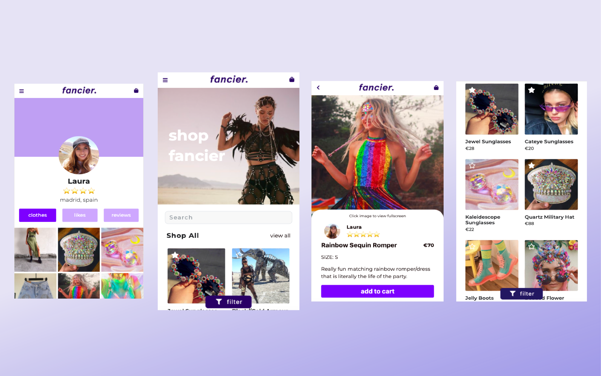

On a team of four we built Fancier, a two-sided sustainable marketplace for festival outfits. I created the UX design, while we all collaborated on the development of the Ruby on Rails application. Users are able to buy and sell festival clothing, along with create profiles, favorites, write reviews, see product recommendations and view dashboard to track shipments and purchases.

Sign up: www.getfancier.com (mobile-only)
Github: www.github.com/themsinglink/FANCIER_APP

[Next Project](/altura)

[Home](/)

