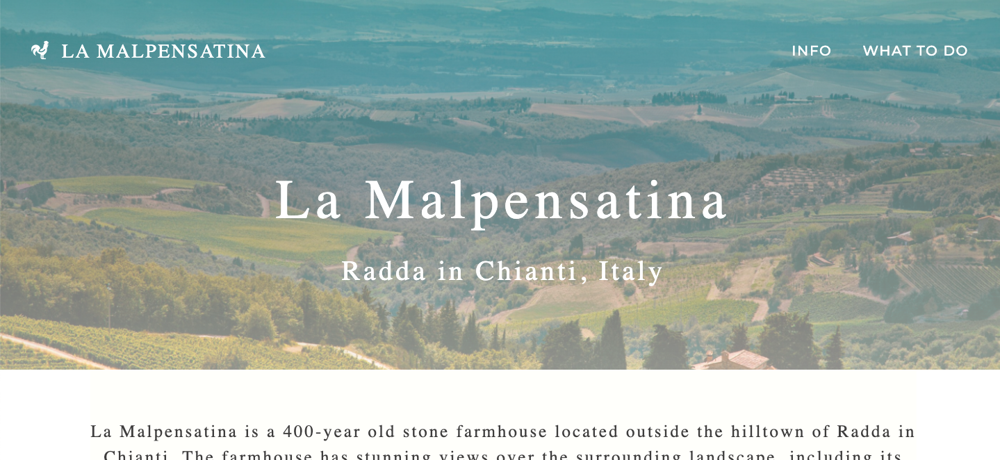

www.lamalpensatina.com

The website is an informational website highlighting the beauty of a farmhouse in Tuscany, Italy. It also includes essential logistics and downloads. I created custom graphic design to give the website a unique and warm feel. I also designed a 15 page welcome packet to send to guests upon booking with all details about the house and area.

[Next Project](/machinelearning)

[Home](/)
